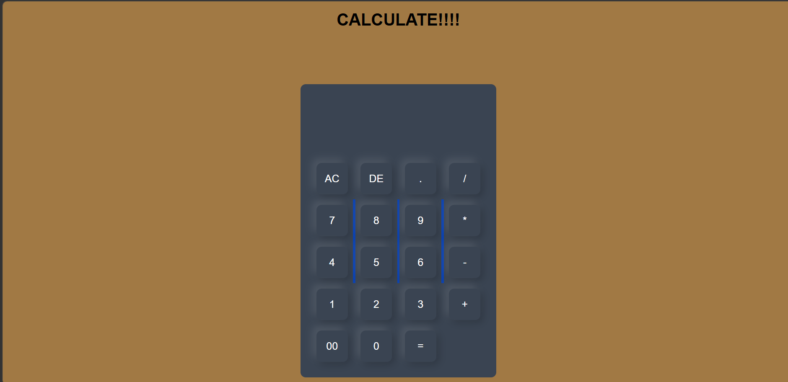

# 🧮 Working Calculator

A simple and responsive calculator web application built using HTML and CSS.
---

## 🌐 Live Demo

👉 https://adityakumarweb.github.io/Working_Calculator/

---

## ✨ Features

- Basic arithmetic operations (+, −, ×, ÷)
- Clear and reset functionality
- Responsive design
- Simple and clean UI
- Beginner-friendly JavaScript logic

---

## 🛠️ Tech Stack

- HTML5  
- CSS3   

---

## 📸 Screenshot

---

## 🚀 How to Run

Clone the repository:

git clone https://github.com/adityakumarweb/Working_Calculator.git

Open the project folder:

cd Working_Calculator

Run the project by opening `index.html` in your browser.

---

## ⭐ Support

If you like this project, give it a ⭐ on GitHub.
